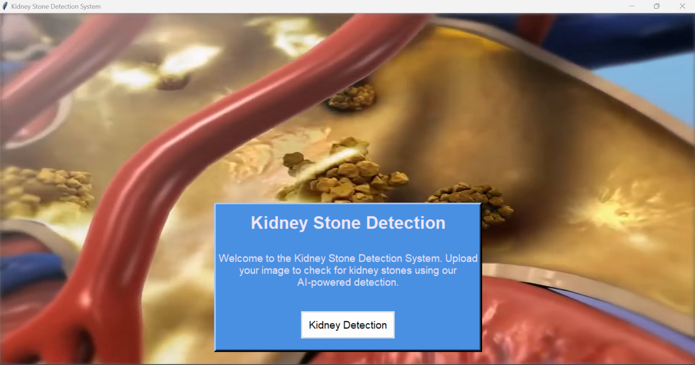
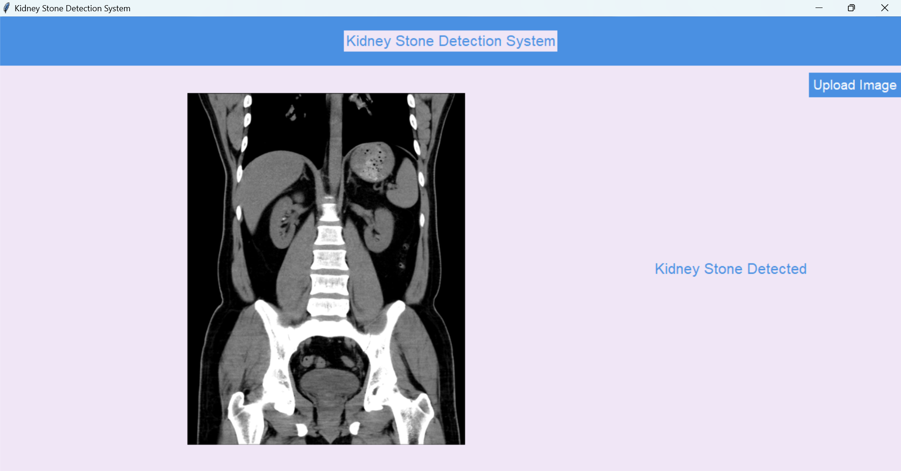

Here's an updated and more interactive README file, incorporating emojis for a fun and engaging experience:

---

# 🩺 Kidney Stone Detection System

Welcome to the **Kidney Stone Detection System**! This project provides a simple, interactive way to detect kidney stones from medical images using AI-powered deep learning. 🧠✨ It features an intuitive graphical user interface (GUI) to upload images and get real-time results. 🎯


## 📋 Table of Contents
- [📖 About the Project](#-about-the-project)
- [🛠 Tech Stack](#-tech-stack)
- [🌟 Features](#-features)
- [🔧 Installation](#-installation)
- [🚀 Usage](#-usage)
- [📂 Project Structure](#-project-structure)
- [🤝 Contributing](#-contributing)
- [📜 License](#-license)

## 📖 About the Project
This project aims to aid in **kidney stone detection** using deep learning. 🩺🔍 The system uses a **Convolutional Neural Network (CNN)** to predict the presence of kidney stones in medical images. The **Tkinter GUI** makes it easy for users to upload images and receive instant results. Plus, a soothing video background adds a modern, engaging touch! 🎥🌊



## 🛠 Tech Stack
- **Programming Language:** Python 🐍
- **Libraries:** 
  - **TensorFlow** & **Keras** 🤖: For building and training the deep learning model.
  - **OpenCV** 🖼️: For image processing and manipulation.
  - **Pillow** 🖌️: For handling image formats in the GUI.
  - **Tkinter** 🖥️: To create a simple, user-friendly graphical interface.
- **Tools:** Visual Studio Code, Git

## 🌟 Features
- **🔼 Image Upload:** Easily upload an image of your kidney scan for analysis.
- **🧠 AI-Powered Detection:** Uses a trained deep learning model (CNN) to predict if a kidney stone is present.
- **📝 Real-time Results:** Displays results immediately, indicating "Kidney Stone Detected" or "No Kidney Stone Detected."
- **🎥 Background Video:** A beautiful looping video background to enhance the visual appeal.
- **🖥️ Interactive GUI:** Simple and responsive interface using Tkinter.

## 🔧 Installation
Follow these simple steps to get started:

1. **📥 Clone the Repository:**
    ```bash
    git clone https://github.com/your-username/kidney-stone-detection.git
    ```
2. **📂 Navigate to the Project Directory:**
    ```bash
    cd kidney-stone-detection
    ```
3. **📦 Install Dependencies:** Ensure you have Python and `pip` installed.
    ```bash
    pip install tensorflow pillow imageio opencv-python
    ```
4. **⬇️ Download the Pre-trained Model:**
   - Place your `kidney_stone_model.h5` file in the project directory.

5. **📝 Update Video File Path:**
   - Replace the `video_path` in the code with the path to your own background video file.

## 🚀 Usage
1. **▶️ Run the Application:**
    ```bash
    python kidney_stone_detection.py
    ```
2. **🖼️ Upload Image:**
   - Click the "Kidney Detection" button on the welcome screen.
   - Then, click "Upload Image" to select a scan image for analysis.

3. **🔍 View the Results:**
   - The system will display the prediction: **"Kidney Stone Detected"** or **"No Kidney Stone Detected"**.

## 📂 Project Structure
```
kidney-stone-detection/
│
├── kidney_stone_model.h5       # Pre-trained model for kidney stone detection
├── video.mp4                   # Background video file (replace with your own)
├── kidney_stone_detection.py   # Main application script
├── README.md                   # This README file
└── requirements.txt            # List of dependencies
```

## 🤝 Contributing
We ❤️ contributions! Follow these steps to contribute:

1. **🍴 Fork this repository.**
2. **🌿 Create a new branch:** `git checkout -b feature-name`.
3. **🛠️ Make changes and commit:** `git commit -m 'Add a new feature!'`.
4. **📤 Push to the branch:** `git push origin feature-name`.
5. **🔄 Submit a pull request!**

## 📜 License
This project is licensed under the **MIT License**. Feel free to use, modify, and share it! 🤗

## 📧 Contact
Got questions or suggestions? Reach out to **[Mohanrao Kulkarni](mailto:mohanrao0702202@gmail.com)**.

---

Feel free to make adjustments to fit your project's specific details! 🎉
